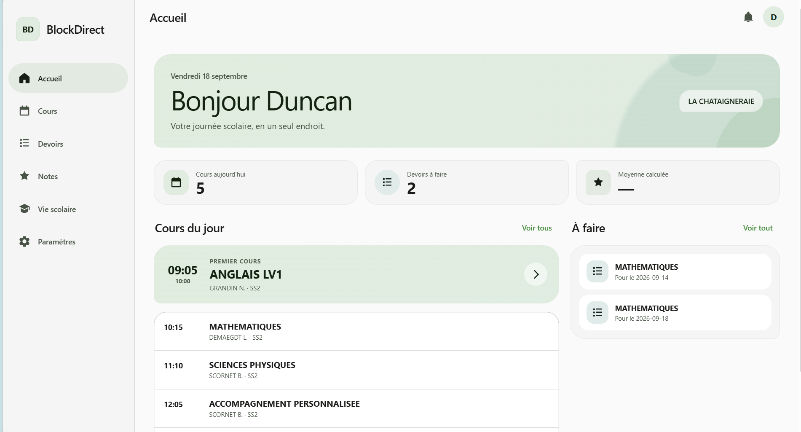
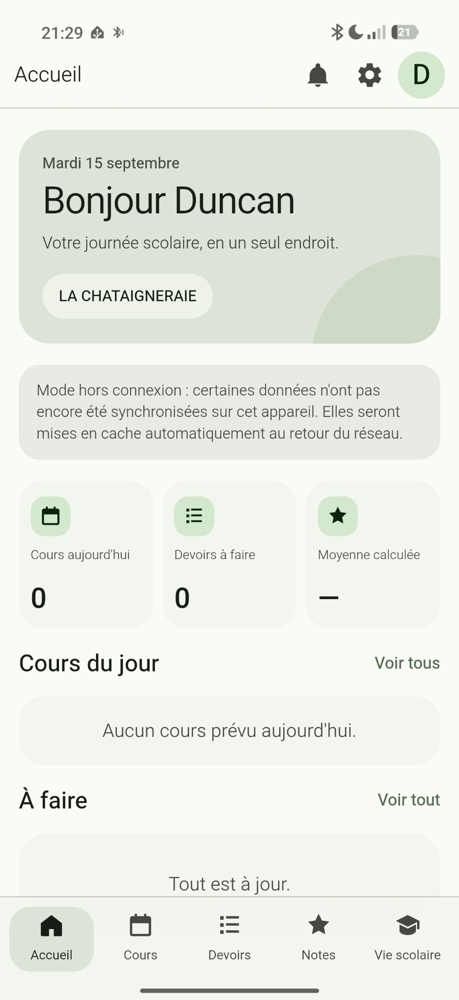

<div align="center">


# BlockDirect

### ÉcoleDirecte, mais en mieux.

Une expérience **Material You / Material 3** moderne pour ÉcoleDirecte,
disponible sur **Windows** et **Android**.

<br>

[](https://blockdirect.fr/)
[](https://github.com/SolucePlay/BlockDirect/releases/latest)
[](https://github.com/SolucePlay/BlockDirect/releases/latest)
[](https://github.com/SolucePlay/BlockDirect/releases/latest)

<br>

[**🌐 Site officiel**](https://blockdirect.fr/) ·
[**⬇️ Télécharger**](https://github.com/SolucePlay/BlockDirect/releases/latest) ·
[**🔐 Sécurité**](https://blockdirect.fr/security.html) ·
[**🔒 Confidentialité**](https://blockdirect.fr/privacy.html)

</div>

---

## 🌿 C'est quoi BlockDirect ?

**BlockDirect** est un client indépendant pour **ÉcoleDirecte** conçu pour proposer une expérience plus moderne, claire et agréable au quotidien.

L'application reprend les informations utiles d'ÉcoleDirecte dans une interface basée sur les principes de **Material You**, avec une expérience adaptée aussi bien aux grands écrans qu'aux smartphones.

> **Simple. Moderne. Rapide. Et pensé pour rester sous votre contrôle.**

---

## ✨ Aperçu

<table>
<tr>
<td width="72%" valign="top">

### 🖥️ Windows



</td>

<td width="28%" align="center" valign="top">

### 📱 Android



</td>
</tr>
</table>

---

## 🚀 Fonctionnalités

<table>
<tr>
<td width="50%" valign="top">

### 📚 Scolarité

* 📅 **Emploi du temps**
* 📝 **Devoirs**
* ⭐ **Notes et moyennes**
* 🎓 **Vie scolaire**
* 📖 **Carnet de correspondance**
* 👥 **Vie de la classe**
* 📰 **Fil d'actualité**
* 📋 **QCM**

</td>
<td width="50%" valign="top">

### 🧩 Services

* 💬 **Messagerie**
* 📄 **Documents**
* ☁️ **Cloud ÉcoleDirecte**
* 🧩 **Espaces de travail**
* 🔗 **Mes Applis**
* 🎥 **Visios**
* 💼 **Suivi des stages**
* 🗳️ **Formulaires et sondages**

</td>
</tr>
</table>

---

## 🎨 Material You

BlockDirect a été conçu autour d'une interface inspirée de **Material Design 3**.

L'objectif est de remplacer les écrans chargés par une interface :

* claire et cohérente ;
* responsive ;
* adaptée au tactile ;
* agréable sur ordinateur ;
* rapide à parcourir ;
* pensée pour les usages quotidiens d'un élève.

---

## 💻 Windows

La version Windows de BlockDirect propose une véritable expérience desktop.

### Principes

```text
BlockDirect
   │
   ├── Interface Material You
   │
   ├── Navigation latérale
   │
   ├── Backend local
   │
   └──────────────► ÉcoleDirecte
```

Le traitement nécessaire au fonctionnement de BlockDirect s'effectue localement sur l'appareil.

### Télécharger

<div align="center">

[](https://github.com/SolucePlay/BlockDirect/releases/latest)

</div>

---

## 📱 Android

BlockDirect est également disponible sous Android avec une interface spécialement adaptée aux smartphones.

### Fonctionnalités mobiles

* navigation tactile ;
* interface responsive ;
* stockage local ;
* synchronisation des données ;
* accès hors connexion aux données compatibles ;
* expérience Material You.

### Télécharger

<div align="center">

[](https://github.com/SolucePlay/BlockDirect/releases/latest)

</div>

---

## 🔐 Confidentialité

La confidentialité fait partie des principes de conception de BlockDirect.

BlockDirect est conçu pour éviter de centraliser les comptes ÉcoleDirecte des utilisateurs sur une infrastructure BlockDirect distante.

```text
┌──────────────────────┐
│   BlockDirect Android│
└──────────┬───────────┘
           │
           └────────────────► ÉcoleDirecte


┌──────────────────────┐
│   BlockDirect Windows│
└──────────┬───────────┘
           │
           ▼
     Backend local
           │
           └────────────────► ÉcoleDirecte
```

Pour plus d'informations :

[**🔐 Sécurité**](https://blockdirect.fr/security.html) ·
[**🔒 Politique de confidentialité**](https://blockdirect.fr/privacy.html)

---

## 📦 Téléchargements

Les versions officielles sont disponibles dans les **GitHub Releases**.

<div align="center">

### Windows

[](https://github.com/SolucePlay/BlockDirect/releases/latest)

[](https://github.com/SolucePlay/BlockDirect/releases/latest)

### Android

[](https://github.com/SolucePlay/BlockDirect/releases/latest)

</div>

---

## 🌐 Site officiel

Retrouvez la présentation complète de BlockDirect sur :

<div align="center">

### [blockdirect.fr](https://blockdirect.fr/)

[](https://blockdirect.fr/)

</div>

---

## 🛠️ Technologies

<div align="center">


</div>

---

## ⭐ Soutenir le projet

Si BlockDirect vous plaît, vous pouvez soutenir le projet simplement en laissant une **⭐ Star** sur le dépôt.

<div align="center">

[](https://github.com/SolucePlay/BlockDirect)

</div>

Les retours, suggestions et signalements de bugs sont également les bienvenus.

---

## 🐛 Problème ou suggestion ?

Vous avez découvert un problème ou vous souhaitez proposer une amélioration ?

➡️ [**Ouvrir une issue**](https://github.com/SolucePlay/BlockDirect/issues/new)

Avant de signaler un problème de sécurité, consultez plutôt la page dédiée :

➡️ [**Sécurité de BlockDirect**](https://blockdirect.fr/security.html)

---

## ⚠️ Projet indépendant

**BlockDirect est un projet indépendant.**

Il n'est **ni affilié, ni associé, ni approuvé par Aplim ou ÉcoleDirecte**.

ÉcoleDirecte, Aplim ainsi que leurs noms, logos et marques respectives appartiennent à leurs propriétaires.

---

<div align="center">


### BlockDirect

**ÉcoleDirecte, mais en mieux.**

[blockdirect.fr](https://blockdirect.fr/) ·
[GitHub](https://github.com/SolucePlay/BlockDirect) ·
[Releases](https://github.com/SolucePlay/BlockDirect/releases)

<br>

Made with 🌿 for a better school experience.

</div>
